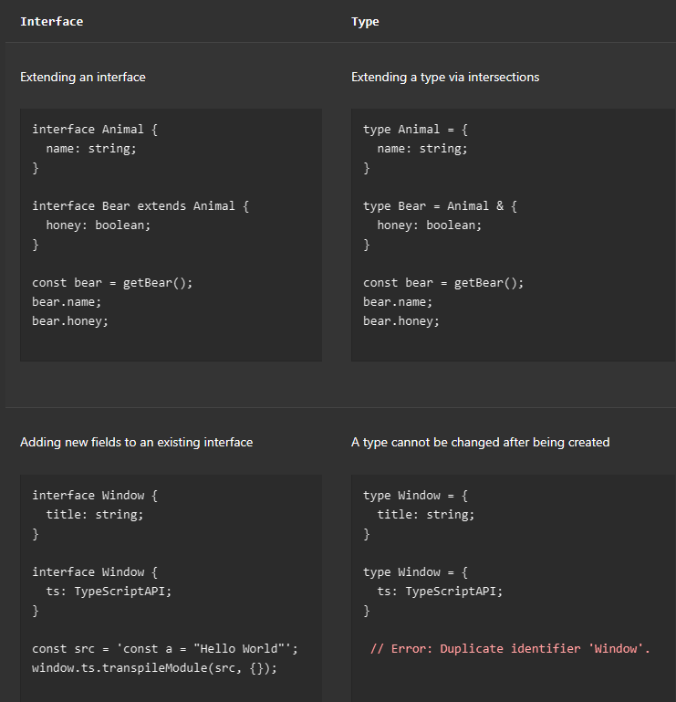
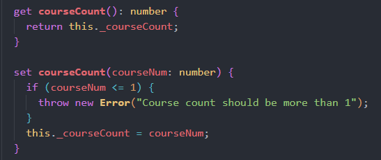
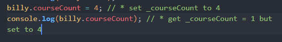
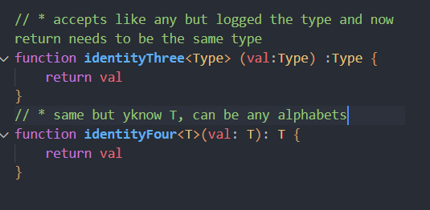

# learn-typescript

# 1. intro to typescript

- how to install
- how to turn typescript to javascript
- type hinting: a lot of data types
- situations: a function accepts 2 numbers, function will return string, typescript make sure this happens
- syntax: `let variableName: type = value`
- method only available for data types is suggested. Thank god
- type inference, typescript smart enough to know what data the variable is. Assigning new variable not required to always type hinting
- DON'T USE ANY:
  When you don’t specify a type, and TypeScript can’t infer it from context, the compiler will typically default to any.

You usually want to _avoid_ this, though, because `any` isn’t type-checked. Use the compiler flag **noImplicitAny** to flag any implicit any as an error.

# 2. basics

- functions can be type inferred as well, both parameter and returns.
- typescript is smart enough for array content. But for function like map or forEach the return can be type inferred
- void and never, void not return anything, never not read any
- type inferring return for object is a little sus, `function funcName(){prop1: type1, prop2: type2}{return {prop1:"",prop2:""}}`
- better to use `type` then infer, more readable
- readonly using `readonly prop: type` optional using `prop?: type`
- Array can be type inferred, and even array of array
- type union, infer multiple types, make it specific
- tuple great, can be specific order type
- enum is great, creates lots of value easily, just use const in front of enum
- interface = better than type, interface is simple, this system wants to have this type of input so this output. Almost all features of an interface are available in type, the key distinction is that a <ins> type cannot be re-opened to add new properties </ins> vs an interface which is always extendable.
  

# 3. typescript in action

- `npx tsc --init` to start, will create tsconfig.json, change tsconfig.json `outDir` to selected directory, `npx tsc -w` to watch all typescript file and compile them in selected outDir.
- Create classes for User
- Default all value inside class is public, but we can make it private. Private cannot be accessed outside the class
- getters and setters, get to access the value, set so we can set the value.
  
  
- private cannot be accessed using extends, protected can be accessed in the class and any class (with extends) but not outside of class
- why is interface so important, it keeps everything tidy, naming becomes strict, so dev can set rules for other devs for naming preferences.
- abstract classes, cannot create their own object but helps extends to new class. Guides new classes to have the same property, put abstract to a method so it needs to be declared (compulsory) in new class, methods and property are extended.
- generics, very cool log the types
  
- generics can be used for array as well, and we can use more than one generic, and can even be used in class
- Narrowing: is super great, super cautious, reduce bugs, always appreciated, using `if(typeof x==="type){then we gud or not gud}`
